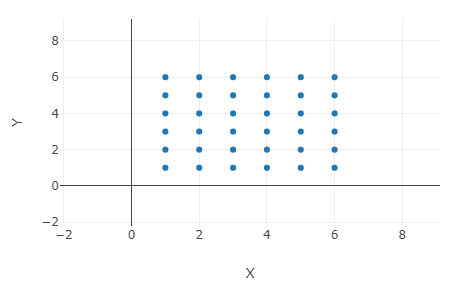
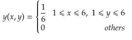
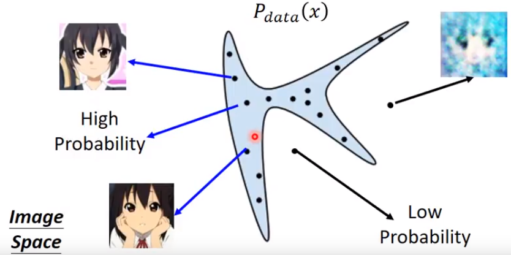
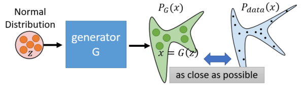
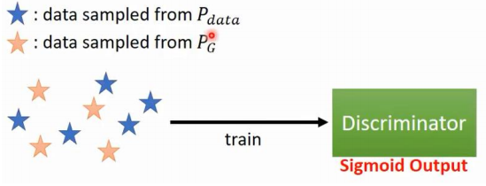

# 分布

### 什么是分布？

抛两颗骰子得到的点数可以看做一个随机变量(X,Y), 显然X和Y的取值只可能是1至6。那么，在(X,Y)构成的二维空间中，所有样本均匀的分布在网格点如下图所示：

如果我们用概率来描述这个分布(x,y 都是整数)的话，那就是

如果有另外一个分布的概率密度和这个一样，那么该分布与投2个骰子所获得的点数的分布是相似的（样本的分布也相似）。

### 分布与图片的关系

分辨率256*256的图片可以看成一个65536维的随机变量(投2个骰子的例子是2维)，那么在这样的一个65536维的高维空间中，一张图片可以是看做是空间中的一个点。如下图所示，由一堆人脸图片构成的点的集合可以看做是一个人脸分布，那么对于该人脸分布而言，在分布之内的点概率不为0，在分布之外的点的概率为0。

在许多论文或者对GAN的介绍里面都可以看到$P_{data}(x)$​这个概念。这里的$x$​也就是指构成图片的像素值(对应空间中的某个点)，因此对于$y=P_{data}(x)$​，$y$是一个概率值，是样本$x$在人脸分布中的概率。

# 最大似然构造人脸的近似分布

假设有函数$P_{G}(x,\theta)$​​, 其中$x$​​是随机变量， $\theta$​​是参数（可以使用高斯混合模型来构造这样一个参数），我们的任务是在给定足够的从$P_{data}(x)$​​进行采样的样本 $\{ {x_0,x_1,...,x_n} \}$​，​​找到一组参数，使得$P_{G}(x,\theta)$​​​​是人脸的近似分布。

我们可以使用最大似然估计来进行参数估计，其基本思想是从目标分布中取出一些样本，写出似然函数，找到使似然函数最大化的一组参数。因此我们把样本代入$P_G(x,\theta)$​得到似然函数：

$L=\prod \limits_{i=1}^n {P_G(x^i,\theta)}$

使L最大化的参数$\theta^*$ 即为目标参数。两边取对数，将累乘转化为累加问题。

$\theta^*=\mathop{argmax}\limits_{\theta} {\sum \limits_{i=1}^n {logP_G(x^i,\theta)}}$

由于$\theta$ 只影响$logP_G(x^i,\theta)$ 部分，因此可以把上一个问题转化为期望问题：

$\theta^*=\mathop{argmax}\limits_{\theta} {\int \limits_{x} {P_{data}(x)logP_G(x^i,\theta)} \mathrm{d}x} $​   或

$\theta^* \approx \mathop{argmax}\limits_{\theta} {E_{x \sim P_{data}} [logP_G(x^i,\theta)]}$​ 

这时在后面添加一项常数不影响最终$\theta^*$​ 的结果

$\theta^*=\mathop{argmax}\limits_{\theta} {\int \limits_{x} {P_{data}(x)logP_G(x^i,\theta)} \mathrm{d}x} - {\int \limits_{x} {P_{data}(x)logP_{data}(x)} \mathrm{d}x}$ $\theta^*=\mathop{argmax}\limits_{\theta} {\int \limits_{x} {P_{data}(x)logP_G(x^i,\theta) - {P_{data}(x)logP_{data}(x)}} \mathrm{d}x}$

最终我们将原式转化为了KL散度的定义，也就是说原式：

$\theta^*=\mathop{argmax}\limits_{\theta} {KL(P_{data}||P_G)}$

KL散度是衡量两个分布之间的距离的，所以从某种意义来讲，我们使用最大似然原理来估计参数，就是在求最小化两分布KL散度时的参数。

然后由于我们不知道$P_{data}(x)$​ 的具体函数，因此无法直接计算人脸分布和拟合分布的散度，也就无法直接找出最优的参数。

## 理论推导

### 生成器做了哪些事？

我们先来回顾下GAN的生成器做了什么事情。这是一张生成器的流程图，z是一个服从正太分布的一个高维随机变量, x是图片，$x=G(z)$​。每一个z对应于图片空间中的一个点，这些点的集合就对应一个分布。调整G的参数，可以改变映射后的分布。显然，最初始的G映射得到的分布与人脸分布相差甚远。因此，我们的任务就是调整G的参数，使分布逐渐向人脸分布靠近，最后我们就可以从z分布中随机采样，经过G的映射获得人脸图片。

所以我们前面提到的优化ϴ就变成了优化G的参数，由前面可知，我们可以通过最小化两分布的散度来获得最优参数。

$G^*=\mathop{argmax}\limits_{\theta} {Div(P_{data},P_G)}$​

### 判别器做了哪些事？

判别器对生成数据和真实数据进行分类，其目标函数为：

$V(G,D)= E_{x \sim P_{data}} logD(x) + E_{x \sim P_{G}} log(1-D(x))$​

$Training: D^*= \mathop{argmax} \limits_{D} V(D,G)$​

从直观上我们很容易就理解，这个最大化值函数就是让判别器真的判为真，假的判为假。但是现在让我们从数学上理解下这个优化过程究竟做了什么事。在给定样本x与G的情况下：

$V= E_{x \sim P_{data}} logD(x) + E_{x \sim P_{G}} log(1-D(x))$​

先转化为积分的形式：

$V={\int \limits_{x} P_{data}(x)logD(x) \mathrm{d}x} + {\int \limits_{x} P_{G}(x)log(1-D(x)) \mathrm{d}x}$ 

对积分进行合并。可能合并这一操作可能会有点跳跃，虽然左右两边一个是真实数据，一个是生成数据，但是他们始终都属于整个图片空间，我们是在整个图片空间上做积分。

$={\int \limits_{x} P_{data}(x)logD(x) +P_{G}(x)log(1-D(x)) \mathrm{d}x}$

在一个给定区域下进行积分，要让积分的值尽可能的大，则一个可行的方法是让积分表达式尽可能的大。那么积分问题就转为了函数最大化问题。表达式为：

$f(x)=P_{data}(x)logD(x)+P_G (x)  log⁡(1−D(x))$

这个函数在已知G，未知D的情况下，若是对于不同的x，表达式的值都要非常大的话，那么我们可以把x看作常数，寻找一个能够使表达式最大的D，这里的D是判别器，D(x)整体可以看作是一个变量，会随着D参数的不同，D(x)的取值也不同。综上所述，令$P_{data}=a$​,$P_G=b$​,则原式为

$f(D)=alog(D)+blog(1-D)$​

那么求解函数最小值，自然会想到求导数的方法，令导数为0的地方

$\frac{df(D)}{dD}=a*\frac{1}{D}+b*\frac{1}{1-D}*(-1)=0$

$D^*=\frac{a}{a+b}$

那么最终将$P_{data}$和$P_G$代回去，就得到了判别器事$V(G,D)$最大的最优参数

$D^*(x)=\frac{P_{data}(x)}{P_{data}(x)+P_{G}(x)}$

现在再把最优的$D^*(x)$代入回$V(G,D)$:

$\mathop{max} \limits_D V(G,D)= V(G,D^*)$

$=E_{x\sim P_{data}}[log\frac{P_{data}}{P_{data}+P_{G}}] + E_{x\sim P_{G}}[log\frac{P_{G}}{P_{data}+P_{G}}]$​​

再次写成积分形式

$=\int \limits_x P_{data}(x)*log\frac{P_{data}}{P_{data}+P_{G}} dx + \int \limits_x P_{G}(x)*log\frac{P_{G}}{P_{data}+P_{G}} dx$​

$=2KL(P_{data}||P_{data}+P_{G}) + 2KL(P_{G}||P_{data}+P_{G})$​

$= 2 JS(P_{data}||P_{G})$

**由此可见，优化判别器其实是在衡量两分布的JS散度。**

# 总结

基于GAN的生成模型，是构造一个函数(生成器)，将随机变量映射为图片。模型映射的所有图片构成一个分布，通过降低该分布和目标的分布之间的散度，可以不断优化生成器的参数。

判别器对生成数据和真实数据进行分类并优化，其实就是在计算生成分布和真实分布的JS散度。优化后的判别器可以充当损失函数，为生成器提供梯度。

