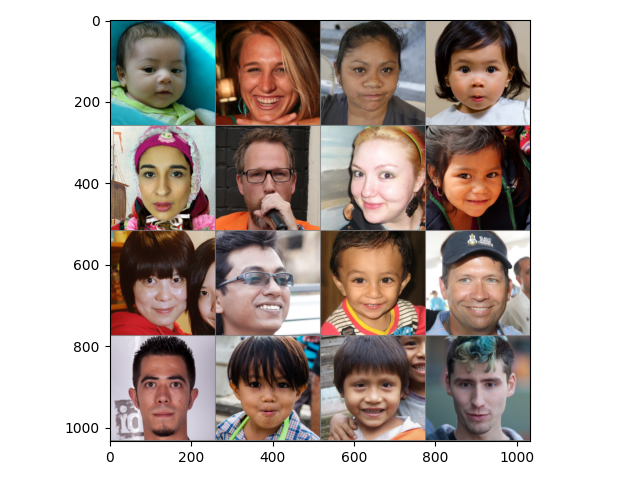

#  Pytorch GAN加载数据集

## 加载指定目录下的图片

工于利其事，必先善其器。加载训练数据集是深度学习基础中的基础，因此在这里将加载数据集这一过程封装好，后续训练GAN时就可以快速进行模型测试了。

为了能够与大部分的pytorch代码兼容，最好是采用pytorch官方推荐的方式，通过继承Dataset实现加载数据的过程。对于GAN的训练，由于大部分情况下不需要与图片对应的标签，所以加载数据的情况可以分为：

1. 图片都放在某一个目录下
2. 图片放在某一个目录及其子目录下

因此可以先找到目录下所有需要处理的图片路径，然后读取图片并转化为Tensor的形式。代码如下，以GAN常用数据集FFHQ为例：

```python
import pathlib
import torchvision.transforms as transforms
from torch.utils.data import Dataset
from PIL import Image

class ImagesFolder(Dataset):
    def __init__(self, root, transform=None,distributed=False,open_mode=None):
        self.images_path = self.getImagesPath(root,distributed)
        self.transform=transform
        self.open_mode = open_mode

    def getImagesPath(self,root,distributed=False):
        if distributed:
            images_path=list(pathlib.Path(root).rglob('*.png'))
        else:
            images_path = list(pathlib.Path(root).glob('*.png'))
        return images_path

    def __len__(self):
        return len(self.images_path)

    def __getitem__(self, index):
        path = self.images_path[index]
        image = Image.open(path)
        if self.open_mode is not None: image = image.convert(self.open_mode)
        if self.transform is not None: image = self.transform(image)
        return image,0

if __name__ == '__main__':
    # 调整图片大小，转化为张量，调整值域为-1到1
    transform = transforms.Compose([
        transforms.Resize((256,256)),
        transforms.ToTensor(),
        transforms.Normalize((0.5, 0.5, 0.5), (0.5, 0.5, 0.5))
    ])
    # 加载数据集
    train_ds=ImagesFolder(r'E:\Data\FFHQ\images1024x1024',transform)
    # 观察数据集
    from torch.utils.data import DataLoader
    from torchvision.utils import make_grid
    import matplotlib.pyplot as plt
    import numpy as np

    train_dl = DataLoader(train_ds, batch_size=16)
    for images, labels in train_dl:
        images = make_grid(images, nrow=4)
        images = np.transpose(images.data * 0.5 + 0.5, [1, 2, 0])
        plt.imshow(images)
        plt.show()
```

当需要使用数据集时，通过DataLoader进行批量加载，数据可视化为如下：



## 后续

上面是训练大部分GAN时可能会用到的操作，但是还有一些其他的比较特殊的GAN可能会有常规加载方式有异，但从该代码的进行修改也能快速适配。